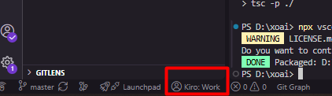
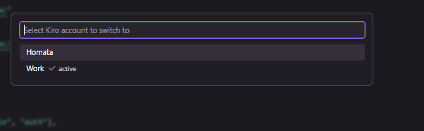
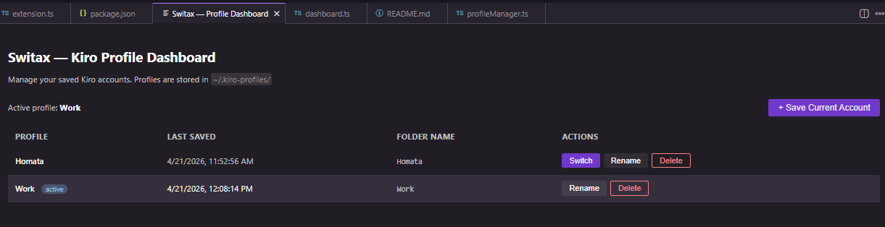

# Switax — Kiro Account Switcher

Switch between multiple Kiro accounts without going through the browser login flow every time.

Built by [Homata](https://github.com/homata123) · [Report an issue](https://github.com/homata123/homata-switac/issues)



---

## Features

- Save your current logged-in Kiro account as a named profile
- Full UI dashboard tab — view, switch, rename, and delete profiles
- Active account always visible in the status bar
- Quick switch via command palette or keyboard shortcut

---

## Usage

1. Log in to Kiro with your first account normally
2. Open command palette (`Ctrl+Shift+P`) → **Switax: Save Current Account as Profile** (e.g. `work`)
3. Sign out of Kiro, log in with a second account
4. Save it as another profile (e.g. `personal`)
5. Use **Switax: Open Profile Dashboard** or click the status bar to manage and switch accounts



---

## Profile Dashboard

Open with `Ctrl+Shift+Alt+D` or via the status bar click. The dashboard shows:

- All saved profiles with last-saved timestamp
- Which profile is currently active
- Actions: Switch, Rename, Delete per profile
- Button to save the current account as a new profile



---

## Keyboard Shortcuts

| Shortcut | Action |
|---|---|
| `Ctrl+Shift+Alt+K` | Quick switch account (quick pick) |
| `Ctrl+Shift+Alt+D` | Open Profile Dashboard tab |

---

## Commands

| Command | Description |
|---|---|
| `Switax: Switch Account` | Quick pick switcher |
| `Switax: Save Current Account as Profile` | Snapshot current auth as a named profile |
| `Switax: Delete Profile` | Remove a saved profile |
| `Switax: Open Profile Dashboard` | Open the full UI dashboard tab |

---

## How it works

Profiles are stored in `~/.kiro-profiles/`. Each profile is a snapshot of Kiro's local auth token files. Switching restores those files and prompts a window reload so Kiro picks up the new credentials.

> After switching, Kiro may ask you to re-authenticate if the token has expired.

---

## Installation

### Option A — Download VSIX from Releases (easiest, no build needed)

1. Go to the [Releases page](https://github.com/homata123/homata-switac/releases)
2. Download the latest `.vsix` file
3. In Kiro: `Ctrl+Shift+P` → **"Extensions: Install from VSIX"** → select the downloaded file
4. Reload Kiro when prompted

### Option B — Build from source

```bash
git clone https://github.com/homata123/homata-switac.git
cd homata-switac
npm install
npm run compile
npx vsce package
```

Then install the generated `.vsix` via `Ctrl+Shift+P` → "Extensions: Install from VSIX".

### Option C — Development mode (no install)

```bash
git clone https://github.com/homata123/homata-switac.git
cd homata-switac
npm install
npm run compile
```

Open the folder in Kiro and press `F5` — launches an Extension Development Host with Switax ready to use.

---

## Storage location

Profiles are saved to:

- Windows: `C:\Users\<you>\.kiro-profiles\`
- macOS/Linux: `~/.kiro-profiles/`

Each subfolder is a named profile containing snapshots of Kiro's auth token files.
