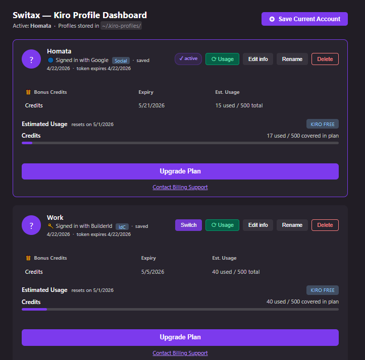

# Switax — Version History

Full changelog for [Switax — Kiro Account Switcher](README.md).

Older `.vsix` builds are archived in the [`archived/`](archived/) folder and can be installed manually via `Ctrl+Shift+P` → "Extensions: Install from VSIX" for rollback purposes.

---

### v0.2.1 — Sign-in info & credits fix
- Provider (Google, GitHub, etc.) and auth method now read directly from the snapshotted at save time — no longer shows "Unknown"
- Plan, credits used/total, bonus credits, expiry, and reset date are preserved from local when re-saving a profile
- Removed manual provider picker prompt — provider is auto-detected from the token file

### v0.2.0 — Account Info Dashboard
**Released:** April 2026

### What's new

**Dashboard redesign — account cards**
Each saved profile now renders as a card matching the Kiro account panel layout:
- Avatar (email initial), email address, and sign-in provider with icon
- Bonus credits table with expiry and estimated usage columns
- Estimated usage section with plan badge (e.g. "Kiro Free") and credits progress bar
- Upgrade Plan button and Contact Billing Support link per card

**Login without sign-out**
A "Log in with another account in browser" button at the bottom of the dashboard opens `https://app.kiro.dev/login` in the default browser. After signing in, the user returns to Kiro and saves the new session as a profile — no need to manually sign out from Kiro's own account tab.

**Duplicate account detection**
When saving a new profile, the extension now asks for the account email upfront. If that email is already stored in an existing profile, it warns the user and offers to update the existing profile's snapshot instead of creating a duplicate.

**Profile metadata**
Each profile folder now contains a local file storing:
- `email` — account email address
- `provider` — sign-in method (Google, GitHub, AWS Builder ID, etc.)
- `savedAt` — ISO timestamp of when the profile was last saved
- `plan`, `creditsUsed`, `creditsTotal`, `bonusCredits`, `bonusExpiry`, `resetDate` — optional fields for future live data integration

**Provider picker**
On profile save, a quick pick asks how the user signed in (Google, GitHub, AWS Builder ID, AWS IAM Identity Center, Other) and stores it in metadata.

### Files changed
- `src/dashboard.ts` — full rewrite with card-based UI
- `src/profileManager.ts` — added `ProfileMeta` interface, `saveProfileMeta`, `readProfileMeta`, `findProfileByEmail`
- `src/extension.ts` — updated `cmdAddProfile` with email input, duplicate check, provider picker
- `package.json` — version bump to `0.2.0`

### Archived build
`archived/kiro-account-switcher-0.1.0.vsix` — previous version, available for rollback.

---

## v0.1.0 — Initial Release
**Released:** April 2026

### What's new

First working version of Switax.

- Save the currently logged-in Kiro account as a named profile (snapshot of local auth token files)
- Switch between saved profiles from the status bar or command palette
- Rename and delete profiles
- Basic dashboard tab listing all profiles with last-saved timestamp and active indicator
- Status bar item showing the active profile name, clicking opens the dashboard
- Keyboard shortcuts: `Ctrl+Shift+Alt+K` (switch), `Ctrl+Shift+Alt+D` (dashboard)
- Safe file copy that skips locked Electron/Chromium cache directories (`Cache`, `Code Cache`, `GPUCache`, etc.) to avoid `EACCES` permission errors while Kiro is running
- Cross-platform auth path detection (Windows, macOS, Linux)

### Files
- `src/extension.ts` — commands, status bar, lifecycle
- `src/profileManager.ts` — auth file snapshot/restore, safe copy logic
- `src/dashboard.ts` — basic webview dashboard
- `package.json`, `tsconfig.json`, `.vscodeignore`

### Archived build
`archived/kiro-account-switcher-0.1.0.vsix` — install via "Extensions: Install from VSIX".
